# Wireshark tehtävä

Wiresharkin asennuksen jälkeen lisäsin itseäni `sudo usermod -a -G wireshark $(whoami)`, langattomaan en päässyt vielä, joten kokeilin huvikseen `bluetooth0` kaappauksen. Liitin läppäriin langattomat kuulokkeet, kokeilin `play/pause` ja `volume up/down` toiminnat, näitä näkee helpoiten kun suodattaa `bluetooth.src == 63:e8:a9:38:b0:2d` jossa MAC osoite kuuluu langattomiin kuulokkeisiin.

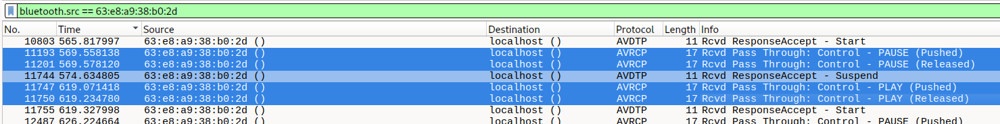

Seuraavaksi kun kirjauduin ulos+sisään (eli mun käyttäjän wireshark ryhmään pääsy tuli voimaan) pääsin jo langattoman (wlp0s20f3) liikennettä kaappata. Huomasin heti, että säännöllisesti, joka sekunnissa menee ICMP pyyntö osoitteeseen `1.1.1.1`, kävi ilmi, että toi onkin osaa mun yläpalkin unohdettua mittaria (lukee `4.16 ms` oikeasta yläkulmasta).

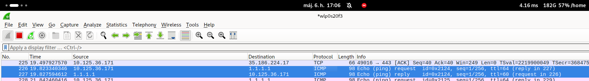

Aloitustilaisuuden yhteydessä mainittiin, että vois SSH:n kautta kirjuatua HY:n palvelimiin, josta pääsee epäsuorasti tohon svm-11 virtuaalikoneeseen, eli alla käytin `ssh` suodatinta, ja luultavasti tuolta näyttää SSH handshake:

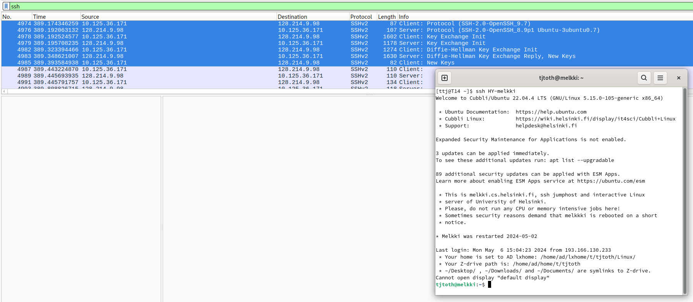

Alla näkyy montako viestiä aiheuttaa enter napin painellus:

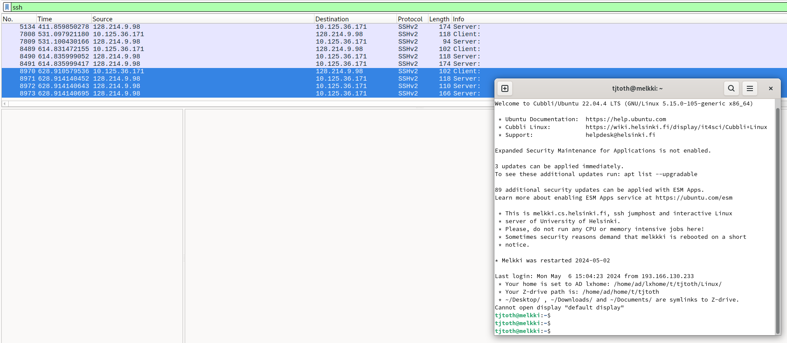

SSH ilmeisesti jokaisella napin painelluksella lähettelee kai 3kpl viestiä, mutta kun käynnistin palvelimessa `sleep 10 && echo faf` komennon, niin 10 sekunnin aikana oli täyshiljaisuus (vika 3 rivi lokissa):

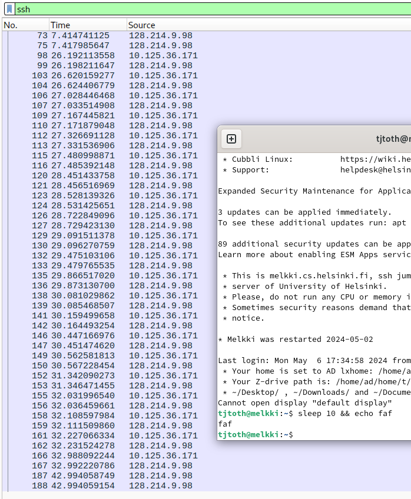

Tuo flow graph ei ollut hirvee iso apua, alla siniseksi maalattuna se ylemmän komennon tekemä `echo faf` osa:

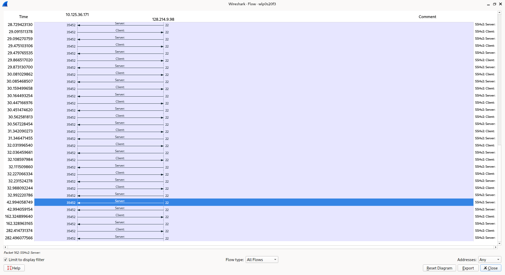

toi I/O graph oli pikkasen hauskempi, kun näpyttelin satunnaisesti ja runsaasti, siellä `500` merkinnän (nauhoituksen alusta 500 sekuntia on kulunut) ympäri näkyy, että syntyi melkoinen liikennettä:

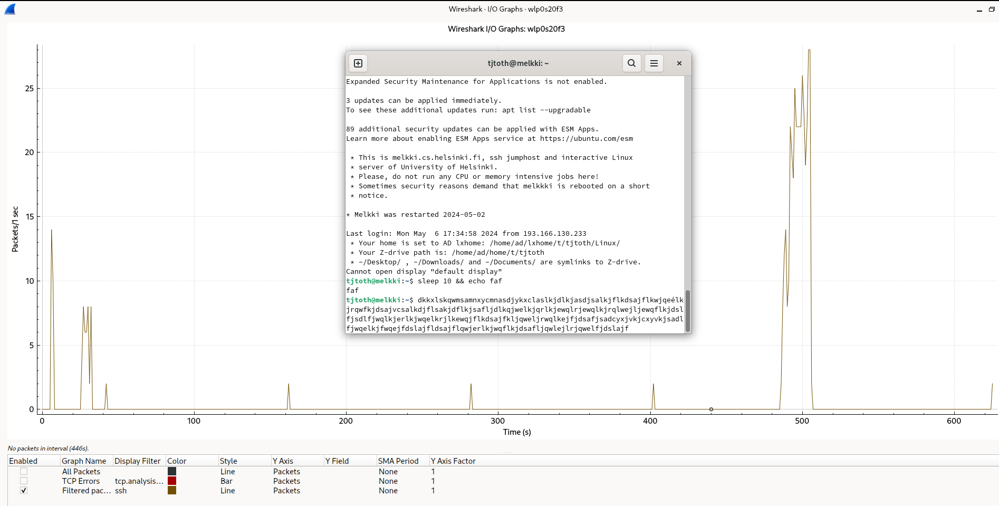

Jommassakummassa visualisoinnissa oli lähes pakko laittaa päälle samat suodattimet (näkyy kuvakaappausten alapuolissa), muuten näkyy **kaikki** kaapattu liikenne josta ei saa mitään selväksi.

Myös huomaa että joka 120 sekunnin välein SSH kommunikoi joka johtuu `~/.ssh/config` tiedoston `ServerAliveInterval 120` rivistä, jota olen säätänyt aiemmin muista syistä:

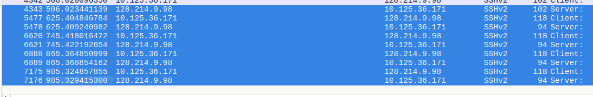

Sitten tuli mieleen katsoa/suodata `dns` protokollaa, koska siirsin mun varaamaa `ttj.hu` nimen cloudflare:in taakse joskus aiemmin ja kun niihin yhdistyy, kyllä heidän nameserver on mainittu:

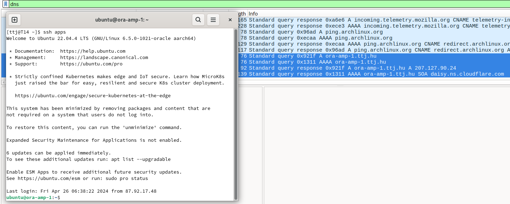

Toisaalta jos SSH ei kuuntele vakioportilla 22, niin wireshark ei enää ees näytä liikennettä yllä suodattimella, vaan piti laajentaa sitä seuraavanlaiseksi `ssh || tcp.port == 55522` jotta persu ssh ja ei vakioportissa kulkeva SSH yhteyskin näkyisi. Oletettu SSH handshake näyttää hiemän sotkusemmalta wireshark:ssa täällä kertaa:

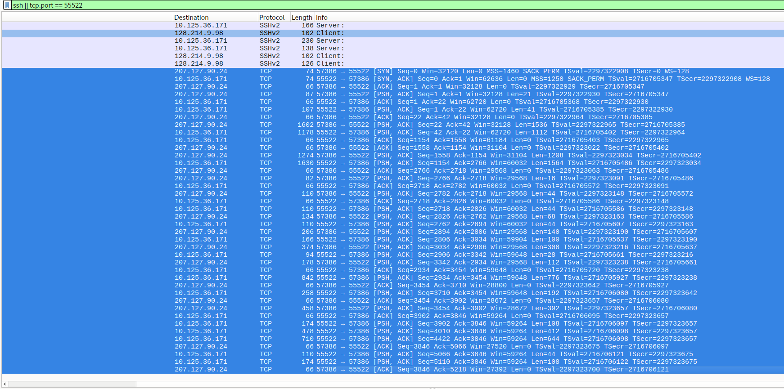

Kolmantena visualisointina kokeilin _DNS_ näkymää josta huomaa, että query:sta on enemmän kuin response:sta (241 vs 84), sekä `A`:sta (IPv4) enemmän, kuin `AAAA`:sta (IPv6) (169 vs 156):

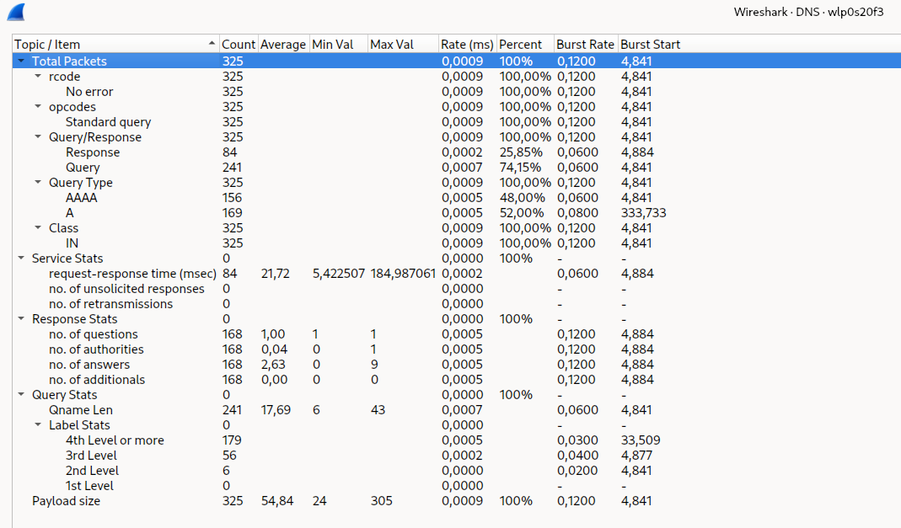

## Tunnit

- 6.5 ~ 4t

  - kurssimateriaalin läpikäynti
  - suodattimet
    - `tcp.port == 55522 || ssh`
    - `dns`
    - `bluetooth.src == 63:e8:a9:38:b0:2d`
      - halpis Lenovo LP40 kuulokkeet

- 7.5 ~ 1t
  - DNS visualization
