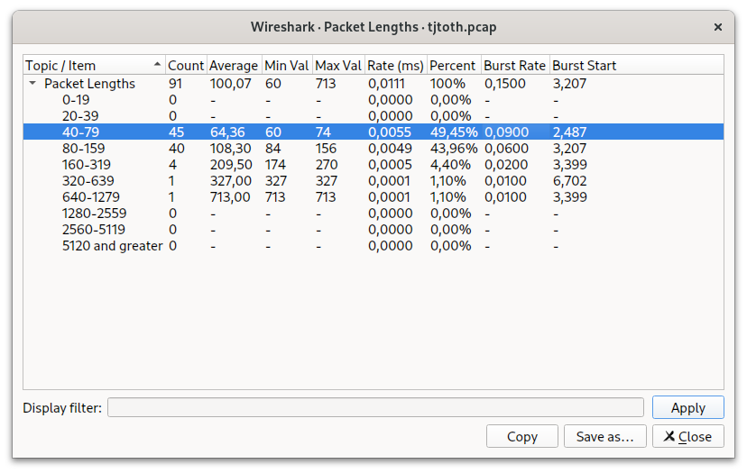
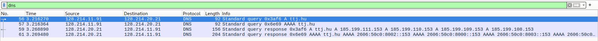
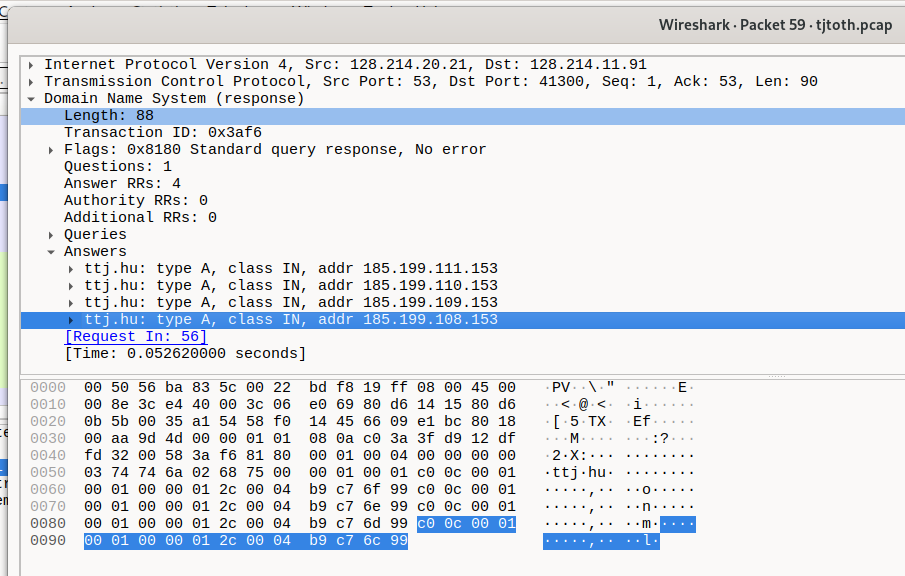
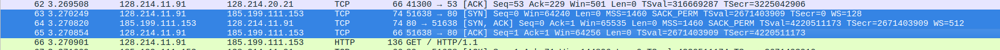
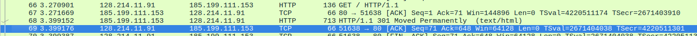
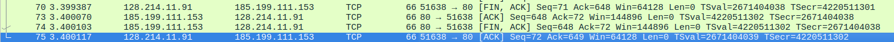
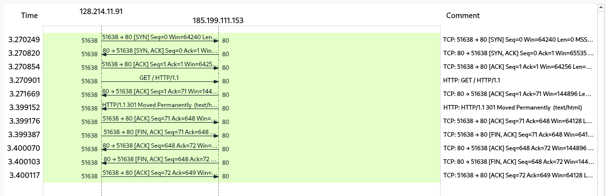
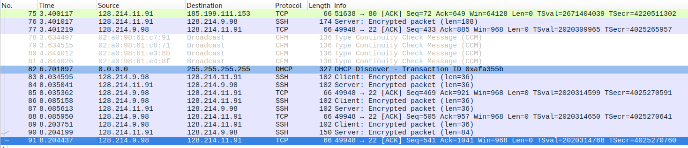

# `tcpdump` tehtävä

Kun tein tän kotinetistä, kirjauduin ensin Melkkiin: 

```sh
AD_TUNNUS=käyttäjätunnus ssh AD_TUNNUS@melkki.cs.helsinki.fi
```

Jossa `AD_TUNNUS` on minun oma Active Directory tunnus, jota piti määritellä, koska kotikoneessa mulla on eri käyttäjätunnus, ja SSH ois käyttänyt sitä oletuksena. Melkistä kirjauduin 

```sh
ssh svm-11.cs.helsinki.fi
```

virtuaalikoneeseen, tässä en enää tarvinnut määritellä käyttäjätunnusta erikseen, koska molemmassa host:ssa mulla on sama käyttäjätunnus. Ohjetta noudattaen kokeilin `chdir /tmp`, mutta kun `chdir` ei ole saatavilla, menin `cd /tmp` mukaan. Kokeilin tuon `tcpdump` komennon, josta ohjeesta sanotaankin, että vaatii superuser oikeudet. `sudo tcpdump` toimi, mutta tulokset meni `stdout`:iin, `man tcpdump` :sta katsoin, että `-w filename` antaa tallentaa tuloksia tiedostoon. Ikävä kyllä tiedoston omistaja on nyt tcpdump:tcpdump eikä pääse ees avaamaan lukemiseen/kopsaamaan sitä:

```sh
$ stat /tmp/$USER.capture
  File: /tmp/$USER.capture
  Size: 7004      	Blocks: 16         IO Block: 4096   regular file
Device: fc00h/64512d	Inode: 1704926     Links: 1
Access: (0600/-rw-------)  Uid: (  109/ tcpdump)   Gid: (  117/ tcpdump)
Access: 2024-05-07 21:13:07.692769061 +0300
Modify: 2024-05-07 21:13:16.504781355 +0300
Change: 2024-05-07 21:13:16.504781355 +0300
 Birth: 2024-05-07 21:13:07.692769061 +0300
```

Googlaamisen jälkeen löytyy `-Z $USER` vipu, joka aiheuttaa tcpdump:in *to drop priviliges* eli lopputulos tiedosto onkin mun käyttäjän omistama. 

## SVM-11:ssa

- lopullinen käyttämäni komento oli `sudo tcpdump -Z $USER -w $USER.pcap &`
  - jota ajoin kotihakemistossani
  - ja jossa viimeinen `&` merkki aiheuttaa komennon taustalla käynnistymistä, 
- täten pystyin generoida liikenteen ajamalla komentoa `curl ttj.hu`
  - joka avasi mun nettisivun
- `fg` komennon ajamalla sain mun taustalla käynnistetyn komennon *foreground* :iin siiretyksi
- jonka jälkeen keskeytin kaappauksen painaten **CTRL-C**
- nyt mulla oli `$USER.pcap` tiedosto mun kotihakemistossa
- jota sain siirretyksi ensin Melkkiin 
  - ajamalla komentoa `scp ./$USER.pcap melkki.cs.helsinki.fi:/home/$USER`
- tän jälkeen kirjauduin ulos SVM-11:sta painamalla **CTRL-D**


## Melkissä

- tarkastin vain, että tiedosto on siirtynyt kotihakemistooni komennolla `ls`
- sitten kirjauduin ulos

## kotikoneesta
- siirsin ton tiedoston melkistä alla komennolla
  - `scp $USER@melkki.cs.helsinki.fi:/home/$USER/$USER.pcap ~`
- avasin wireshark
  - jossa avasin tiedoston file/open (**CTRL-O**)
  - valitsin `$USER.pcap` tiedoston

### Wireshark

Kaappaus kesti yhteensä vähän yli 8 sekuntia, jonkun aikana en ole käyttänyt mitään suodatinta. Yhteensä oli 91 pakettia kaapattua, *Statistics -> Packet Lengths* visualisoinnin mukaan 49,45% niistä oli kooltaan 40-79 ja toiseksi suurin osa (43,96%) oli kooltaan 80-159 tavua. 



Kun käynnistin `curl ttj.hu` komennon, ensin tuli DNS pyyntöjä, 2kpl sekä IPv4 että IPv6 osoitteen selvittämiseksi, ja vastauksia tuli molempaan (yhteensä siis 4kpl viestiä).



Kuten näkyy paketista #59 saadaan vastaukseksi 4kpl IPv4 osoitetta:



..joista otetaan yhteyttä osoitteeseen `185.199.111.153`. Paketit 63..65 luo HTTP yhteyden palvelimen kanssa (`SYN` -> `SYN, ACK` -> `ACK`)



Paketeissä 66-69 selain pyytää `GET` methodilla juurihakemiston `/` protokollaa `HTTP/1.1` käyttäen, sekä pyynnöllä, että vastauksella on omat kuittaukset.



Vastauksen mukaan ttj.hu on muuttanut toiseen osoitteeseen, mutta kun `curl` oletuksena ei seuraa näitä uudelleenohjauksia (redirect :ejä) niin selain rupeaa heti sulkea yhteyden (`FIN, ACK` -> `ACK` -> `FIN, ACK` -> `ACK`).



Keskustelun paketit näkyy eri tavalla, ei välttämättä paremmin alla flow chart:ssa:



Seuraavaa 2kpl pakettia kuului kaappauksessani SSH protokollaan, IP osoitteiden perusteella SVM-11 on lähettänyt Melkille curl:in konsooliriville tulostettuja muutoksia yhtenä viestinä, jota Melkki on kuitannut. Loput SSH protokollan paketit antaa ilmi miten olen nostanut foregroundiin sen kaappausprosessin ja lopettanut kaappausta.




## Tunnit

- 7.5 ~ 1t
  - 2 kaappauskokeilua
- 8.5 ~ 2t
  - onnistuin kaappaamaan VM:ssa SVM-11 luettavan/siirrettävän tiedoston + kirjasin tän raportin
- 12.5 ~ 2t
  - raportin jatkaminen
- 13.5 ~ 3t
  - raportin jatkaminen
