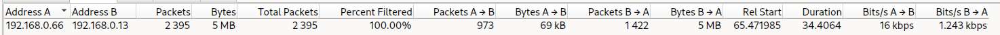
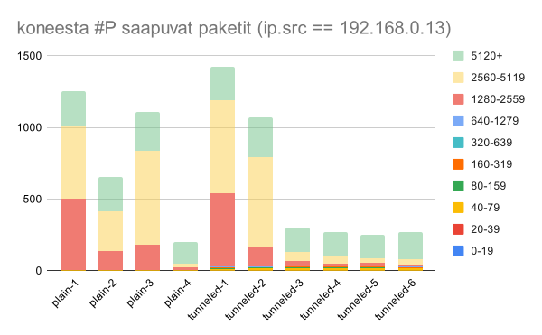

# SSH tunneloinnin tuottama lisäliikennettä

_tekijä Tamás Tóth_

<div style="page-break-after: always;"></div>

## Johdanto

Tässä tutkimuksessa pohdin paljonko enemmän paketin/viestin vaihdon aiheuttaa SSH tunnelin käyttö oman tietokoneen verkkoliikenteen kaappauksen avulla. Vilkasin myös pakettikoiden jakautumaa palvelin ja asiakkaan näkökulmasta.

## Tutkimusprosessin kuvaus

Tutkimuksessa käytin 2kpl tietokonetta, jotkut sijaitsevat samassa aliverkossa. Alkuperaisesta suunnitelmasta poiketen, en ole käyttänyt 1kpl verkkokaapelia yhteyden luontiin, vaan käytin oman langattoman kotiverkoston DHCP palvelua, joten **palvelin** roolissa osallistuvan **koneen #P** osoite oli `192.168.0.13` ja **asiakas** roolissa osallistuvan **koneen #A** osoite oli `192.168.0.66`.

**Koneessa #P**:

- valmiiksi pyöri `openssh` palvelu joka mahdollistaa koneesta #A tunnelin rakentamisen
  - tutkimuksen aikana käytin sekä SSH:n vakioportin 22, että toisen 55522
- loin tyhjän kansion minun kotihakemistossa `mkdir asdf && cd asdf`
- loin testeissä siirrettävän datan komennolla `dd if=/dev/urandom of=resurssi bs=1k count=5120`
- käynnistin `python` tulkin ja copy-paste:asin alla skriptin siihen

```python
import http.server
import socketserver
import socket

PORT = 8080
ADDR = socket.gethostbyname(socket.gethostname())

with socketserver.TCPServer(("", PORT), http.server.SimpleHTTPRequestHandler) as httpd:
    print(f"Avaa http://{ADDR}:{PORT}/resurssi koneesta #A")
    httpd.serve_forever()
```

- tässä vaiheessa **koneessa #P** portilla 8080 oli saatavilla:
  - sekä yllä mainitun _asdf_ hakemiston listaus (polulla `/`),
  - että testitiedosto _resurssi_ (polulla `/resurssi`)

**Koneessa #A**:

- referenssisiirto (pelkästään HTTP:n kautta **koneen #P** IP osoitteen käyttäen)

  - käynnistetin kaappauksen kurssin _tcpdump tehtävän_ mukaisesti ja siirretään kaappausprosessi taustaan komentoa `N=1 sudo tcpdump -Z $USER -w plain-$N.pcap &` käyttäen
    - jossa _N_ oli kasvatettu jokaisella nauhoituksella
    - loput vivut oli käsiteltyjä aiemman palautettavan tehtävän yhteydessä
    - `&` merkki lopussa käynnistää prosessi taustalla
  - latasin tiedoston **koneesta #P** komentoa `N=1 curl http://192.168.0.13:8080/resurssi --output plain-$N.dat` käyttäen
    - jossa taas _N_ oli kasvatettu jokaisella nauhoituksella
  - nostetin kaappauksen prosessi foreground:iin `fg` komentoa käyttäen, sitten keskeytin sitä _CTRL-C_ painelleen

- siirto SSH tunnelin kautta

  - käynnistin liikenteen kaappauksen, mutta tallensin tuloksia eri tiedostoon: `... tunneled-$N.pcap &`
  - rakensin tunnelin **koneesta #A** **koneeseen #P** komennolla `ssh -p 55522 -N -L 8080:localhost:8080 192.168.0.13 &`,

    - jossa `-p 55522` tarvitsin siinä tapauksessa kun palvelimessa pyörivä SSH daemon kuunteli portilla 55522, muuten sitä ei tarvita (portti 22)
    - käytännössä kytkin **koneen #A** portti _8080_ (`192.168.0.66:8080`) **koneen #P** porttiin _8080_ (`192.168.0.13:8080`)
    - **koneessa #P** _~/.ssh/authorized_keys_ oli valmiiksi sisälletty **koneen #A** _~/.ssh/id.pub_, ei tarvinnut käsin kirjautua

  - siirsin tiedoston komennon `N=1 curl http://localhost:8080/resurssi --output tunneled-$N.dat` avulla
    - _N_ oli kasvatettu jokaisella nauhoituksella
    - muistutuksena SSH tunnneli on kytkenyt **koneen #A** portin _8080_ **koneen #P** porttiin _8080_, eli kaikki sinne saapuva pyyntö _automaagisesti_ ohjautuu tämän kytkennän mukaisesti
    - python tulkki **koneessa #P** tulosti jokaisen saapuvan pyynnön lähteen osoitteen, (aiempi pyyntö saapui osoitteesta _192.168.0.66_) ja tämä tuli osoitteesta _127.0.0.1_`, eli skriptin näkökulmasta tämä pyyntö syntyi **koneessa #P** itsessään
  - suljin SSH tunnelin
    - `jobs` komentoa käyttäen katsoin mitkä prosessit pyöri taustalla
    - valitsin ensin SSH tunnelin, minun tapauksessa `fg 2`
    - sammutin _CTRL-C_ painellen
  - lopetin myös liikenteen kaappausta

## Analyysi

_Conversations_ näkymä löytyi vasta posteritilaisuuden jälkeen, sillä pystyin katsoa tarkasti paljonko dataa on siirtynyt. _Packet lengths_ näkymä myös oli käytössä saamaan selväksi osapuolien lähettämien pakettien koiden jakautumaa.

<div style="page-break-after: always;"></div>

## Tutkimustulokset ja niiden analyysi

Kaavioiden käyttämä raakaa dataa [tässä](https://docs.google.com/spreadsheets/d/1iMdz-mzAZvqoU0inuUuqJ8uMR2AHD7dTKB8icnSVH94/edit?usp=sharing).

Kaappausvaiheessa huomasin, että syntyneiden `*.pcap` tiedostojen koko hiemän ylittää odotetun ~5Mt, niin tein sekä tunnelia käyttäen, että käyttämättä muutamaa kaappausta. Siirsin palvelimessa SSH:n kuuntelemaan sen vakioporttiin (22) 1 kaappauksen ajaksi. Asiakkaan koneesta olen myös kokeillut miten vaikuttaa `-o Compression=no` tunnelia rakentaen.

### plain kaappaukset

Tutkimukseen liittyvä liikennettä `ip.addr == 192.168.0.13`:

1. 1976kpl pakettia (5Mt) siirretty 70Mbps nopeudella
   

1. 1138kpl pakettia (5Mt) siirretty **4.5kbps** (?!) nopeudella
   

1. 1956kpl pakettia (5Mt) siirretty 99Mbps nopeudella
   

1. 354kpl pakettia (5Mt) siirretty 96Mbps nopeudella
   

Aiheeseen ei liittyvä liikennettä `ip.addr != 192.168.0.13`:

1. raskeimmat siirrot näistä oli 8+4+0,7 Mt, joita lähetettiin [RIPE NCC](https://www.ripe.net/about-us/what-we-do/) organisaatioon kuuluville osoitteille
   

1. jälleen raskeimmat siirrot oli 8+4+3+2+0,8 Mt, jotkut kaikki meni samoin RIPE NCC varaamille osoitteille
   

1. taas, suurimmat siirrot (7+4+2+0.8 Mt) oli tehty RIPE NCC:n osoiteavaruuteen
   

1. jälleen, 8+3+1+0.6 Mt oli siirretty RIPE NCC:n osoiteavaruuteen
   

Yllä käytin perus `whois x.x.x.x` komentoja saada selväksi keneen/mihin kuuluu nämä kyseessä olevat osoitteet. Ilmeisesti nuo IP osoitteet ovat jaettuja eteenpäin - ihmettelinkin, kun on noin isoja varauksia, esim. `NetRange: 89.0.0.0 - 89.255.255.255` ja aika monta eri osoitetta on tuon RIPE NCC:n varaamaa. `whois` kysely palautti riittävän määrän tiedon, jonkun mukaan tein toisen kyselyn selaimen kautta: osoitteelle http://www.ripe.net/whois, ja kävi ilmi että ne isoimmat siirrot oli _MEGA Cloud Services Limited_. Tässä vaiheessa olisi varmasti hyvä mainita, että kyseessä oleva **kone #A** on minun _daily driver_ ja **kone #P** sen edeltäjä. Nauhoituksen ajaksi olen sammuttanut pelkästään webselaimet, mutta unohdin kokonaan taustalla pyörivästä synkronointipalvelusta (joka siis tekee lennossa varmuuskopioita minun henkilökohtaisista tiedostoista).

<div style="page-break-after: always;"></div>

### tunneloidut kaappaukset

Tutkimukseni aiheeseen kuuluvaa liikennettä (samalla suodattimella, kuin plain kaappausten tapauksessa):

1. SSH kuunteli portilla 55522 **koneessa #P**
   

1. SSH kuunteli portilla 22 **koneessa #P**
   

1. SSH kuunteli portilla 55522 **koneessa #P**
   

1. SSH kuunteli portilla 55522 **koneessa #P**, tunnelia rakennettiin ilman compressiota
   

1. SSH kuunteli portilla 55522 **koneessa #P**, tunnelia rakennettiin ilman compressiota
   

1. SSH kuunteli portilla 55522 **koneessa #P**
   

Aiheeseeni ei kuuluva liikenne, samoin, kuin plain-N tapauksessa, raskaimmat kuului MEGAsync:iin:

1. SSH kuunteli portilla 55522 **koneessa #P**
   

1. SSH kuunteli portilla 22 **koneessa #P**
   

1. SSH kuunteli portilla 55522 **koneessa #P**
   

1. SSH kuunteli portilla 55522 **koneessa #P**, tunnelia rakennettiin ilman compressiota
   

1. SSH kuunteli portilla 55522 **koneessa #P**, tunnelia rakennettiin ilman compressiota
   

1. SSH kuunteli portilla 55522 **koneessa #P**
   

<div style="page-break-after: always;"></div>

### Vertailu

_Conversations_ näkymän mukaan kaikessa 10 tapauksessa siirretty dataa on tasan "5 Mt". Luotan tähän näykmän antamaan numeroon enemmän, kuin posterissa näkyvään _Packet lengths_ näkymän tietoihin perustuvaan omaan laskelmaani. 5 Mt siirron tapauksessa tunneloinnin tuottama lisäliikenne katoaa perus matikan pyöristyssääntöihin.

#### Vaihtelevat pakettien määrät

Huomasin, että pakettien määrä vaihtelee aika lujaa samankaltaisten siirtojen välissäkin (plain-1 vs plain-4). Kun katsotaan kronologisessa järjestyksessä, voidaan päätellä, että langattomassa verkostossa oli jonkunlainen häiriö, joka poistui 3. tunneloidun nauhoituksen alkamista ennen:


Juurisyytä en lähtenyt selvittämään.
Pakettien kokonaismäärä on siis **tunnelia käyttäen** (4 mittauksen perusteella keskimäärin): 512kpl, samoin tunnelia käyttämättä 354kpl, josta voi laskea **yli 40% enempää pakettia**.

#### pakettikoiden jakautuma

**Koneen #A** saamat paketit ovat melko isoja, suurin osa niistä tippuu Wiresharkin isoimpiin luokittamiin kategorioihin (1280+ tavua), nehän sisältävät käytännössä ladatun tiedoston:



Samalla **koneen #A** lähettämät paketit ovat lähinnä kuittauksia, enintään 160 tavun kokoisia:


Mielenkiintoinen ilmiö, että tunnelia käyttämättä lähes kaikki **koneeseen #P** lähetetyt paketit ovat kooltaan 40-79, mutta **tunnelia käyttäen koot myös kasvoi** (yllä kaavion vihreät alueet) ylittäen 80 tavua. **Koneeseen #A** saapuvien pakettien koossa en huomannut tunnelin käytön vaikutusta.

<div style="page-break-after: always;"></div>

## Reflektio:

- Ei olisi saanut sisältää SSH tunnelin rakentamisen kaapauksiin, koska niitähän Wireshark on laskenut mukaan "siirron kestoon" vaikka niissä olikin muutamaa sekuntia tyhjäkäynti, kunnes käynnistin latauksen käsin ja sammutin tunnelin.
- Myös olisi pitänyt testitiedoston koota kasvattaa, vaikka 500Mt, ehkä silloin olisi käynyt ilmi _Conversations_ tilastosta pari Mt lisäliikennettä tunnelia käyttäen.
- Lisäksi olisi pitänyt myös sammuttaa MEGAsync:in nauhoituksen ajaksi.
- Olisi pitänyt välttää langattoman verkoston ja käyttää suunnitelmani mukaan 1Gbe kaapelia, jotta pakettimäärien vaihtelu ois ollut paljon pienempi/tasaisempi

<div style="page-break-after: always;"></div>

## Posteritilaisuuden raportti

Tässä 27.5 järjestetyn posteritilaisuuden raportit 5 eri minun opiskelijatoverin tekemistä.

### Shein vs Zalando sivustojen vertailu

_tekijä Mari Lehtikari_

Tosi hienot pie chartit, jotka näyttävät palvelimien maantieteellistä jakautumaa.
Mielenkiintoinen että se eurooppalaisille tarkoitettu Shein domain ottaa ylivoimaisesti Yhdysvaltalaisiin palvelimiin yhteyttä. Toisin Zalandon suomalaisille domain odotusten mukaan kyselee Suomessa sijaitsevia IP osoitteita (Y). Jännä miten monta kertaa enempää Shein tallentaa evästeitä, mitäköhan noissa säilytetään? hmm...

### Twitch vs Youtube live - streamauspalveluiden vertailu

_tekijä Helinä Lähteenmäki_

Ihana nähdä, että kyberjättiläinen firma Google käyttää ylivoimaisesti IPv6 verkostoa, ja oletettavasti pienempi (en seuraa uutisia tällä tasolla) firma Twitch ilmeisesti pyörittää palvelujansa vielä IPv4 verkostossa. Tosi kivoja nuo sarakevertailukaaviot ja ne 2 isoja logoja alussa! Yllättävä, että Twitch toteuttaa striimauspalvelunsa TCP:ta käyttäen. Myös mielenkiintoinen, että Twitch on siirtänyt noin 3x enempää dataa, kävikö ehkä silleen mittauksen aikana, että käytätty bandwidth vaan loppui kesken ja YouTube vaihtoi automaagisesti (ja nopeammin) surkeampaan kuvalaatuun, esim 1080p -> 720p (niin Twitch ei huomannut ongelmaa ja striimasi paremman kuvalaadun)?

### Suoratoistosivustojen tietoliikenteen vertailu

_tekijä Venla Rantanen_

Tässä tutkimuksessakin on hieno nähdä että isompi firma Netflix käyttää paljon enempää IPv6, mielenkiintoista myös, että Netflix pystyy hoitaa samaa asiaa 35+6=41 palvelimen avulla, jota Aniwave 56+78=134 kautta, toki jos ymmärsin oikein Aniwave säilyttää näitä sisältöjä monessa eri paikassa, joten käykin järkeväksi noi numerot. Kommunikaation vaikuttaa Aniwave:n puolelta tasaisemmalta, ehkä käyttäjän näkökulmasta kuitenkin ois parempi ne isot piikit jossa olettaisin, että puskuroidaan kerralla enempää, niin jos kenttä heikkenee, ei käyttäjä huomaa sitä heti (?).

### Uutissivustojen tietoliikenteen vertailu

_tekijä Sandra Sillanpää_

Hieno vertailun näkökulma, ja ei tullut yllätyksiä, mainosten lataaminen/hallinta aiheuttaakin lisäliikennettä :P Samoin kuin tässä 2 toisessa arvostelussani, se isompi/vakavampi osapuoli (Yle) käyttää parempaa teknologiaa (QUIC vs Iltalehden kunnon vanha TCP), se on järkevä! Pakettien siirtymisen jakautuma näyttää periaateltaan samalta, molemmassa näkyy alun jälkeenkin piikkejä, toki jos Iltalehden mainoksia vaihtuivat, niin se käy täysin järkeväksi.

### Puheluiden kaappaus Telegramin ja Discordin kautta sekä niiden vertailu

_tekijä Elisa Mero_

Tutkimusmenetelmä on hyvin kuvattu, tosi mielenkiintoinen pohdinta tuossa alussa, että voisi saada äänirataa noista kaappauksista, varmasti olisi hyvin vaativa työ! Ja jälleen en osaa sanoa kumpi firma on isompi/vakavampi, siitä protokollien vertailusta vetäisisin johtopäätöksen, että Discord olisi voittaja :)

## Tuntikirjanpito

| pvm       | tunnit | saavutusten kuvaus                                                                        |
| --------- | ------ | ----------------------------------------------------------------------------------------- |
| 6.5.2024  | 4      | kurssimateriaalin läpikäynti, eri suodattimien kokeilu                                    |
| 7.5.2024  | 1      | DNS visualization                                                                         |
| 7.5.2024  | 1      | 2 kaappauskokeilua                                                                        |
| 8.5.2024  | 2      | kaappaus VM:ssa SVM-11 luettavan/siirrettävän tiedoston                                   |
| 10.5.2024 | 1      | aiheen keksiminen                                                                         |
| 12.5.2024 | 2      | raportin jatkaminen                                                                       |
| 13.5.2024 | 3      | raportin jatkaminen                                                                       |
| 16.5.2024 | 6      | tehtävänannon lukeminen; tutkimuksen menetelmän kuvaus; nginx.conf                        |
| 17.5.2024 | 2      | luovutin nginx:sta, otin python skripti käyttöön; yms                                     |
| 20.5.2024 | 4      | alkeellinen .html pohja posterille, josta luovutin; posteriluonnos; eka kaappaukset tehty |
| 26.5.2024 | 3      | posteriluonnos jatko                                                                      |
| 27.5.2024 | 3      | 5kpl arvostelun kirjaaminen                                                               |
| 28.5.2024 | 9      | loppuraportti                                                                             |
| 29.5.2024 | 7      | loppuraportti                                                                             |
